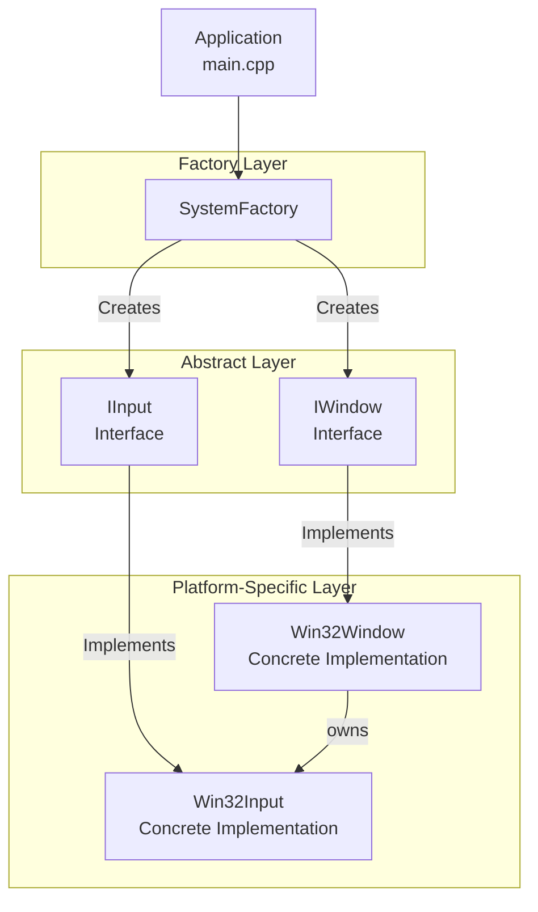
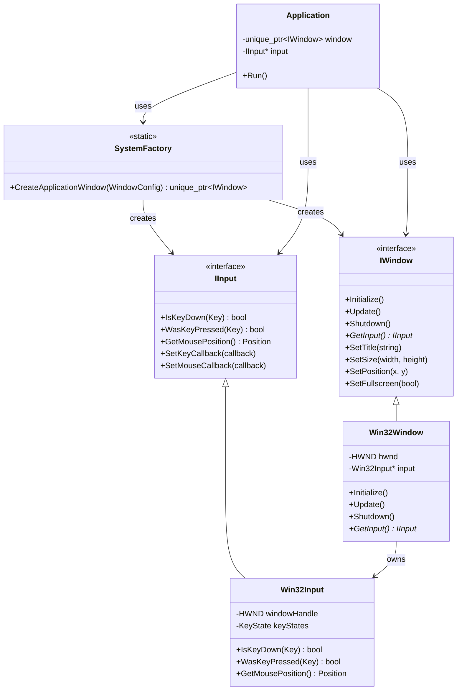
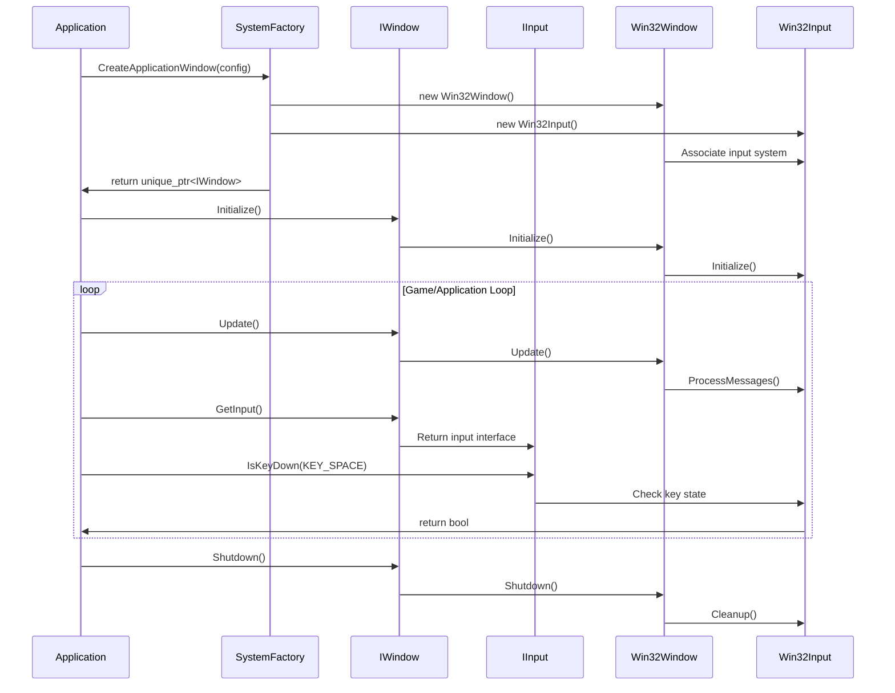
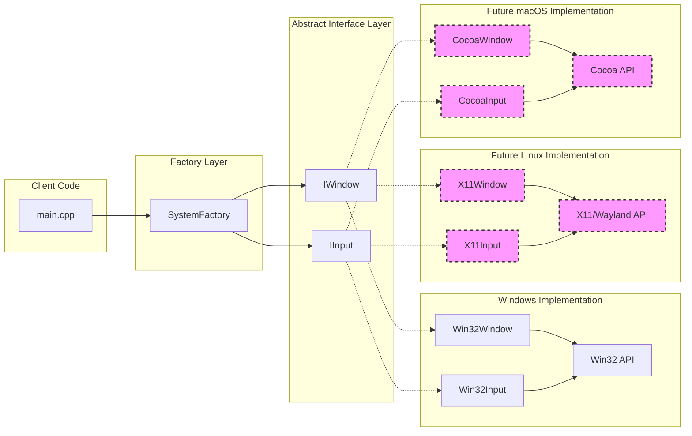
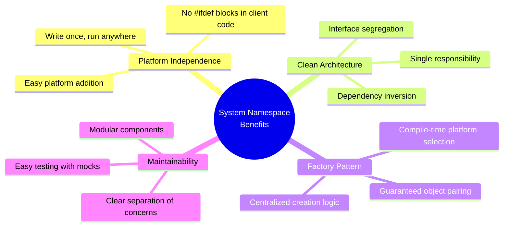

# System Namespace Architecture - Mermaid Diagrams

## Overall System Architecture

```mermaid
graph TB
    App[Application<br/>main.cpp] --> Factory[SystemFactory]
    Factory --> |Creates| IWindow[IWindow<br/>Interface]
    Factory --> |Creates| IInput[IInput<br/>Interface]
    
    IWindow --> |Implements| Win32Window[Win32Window<br/>Concrete Implementation]
    IInput --> |Implements| Win32Input[Win32Input<br/>Concrete Implementation]
    
    Win32Window --> |owns| Win32Input
    
    subgraph "Abstract Layer"
        IWindow
        IInput
    end
    
    subgraph "Platform-Specific Layer"
        Win32Window
        Win32Input
    end
    
    subgraph "Factory Layer"
        Factory
    end
```

## Component Relationships

```mermaid
classDiagram
    class IWindow {
        <<interface>>
        +Initialize()
        +Update()
        +Shutdown()
        +GetInput() IInput*
        +SetTitle(string)
        +SetSize(width, height)
        +SetPosition(x, y)
        +SetFullscreen(bool)
    }
    
    class IInput {
        <<interface>>
        +IsKeyDown(Key) bool
        +WasKeyPressed(Key) bool
        +GetMousePosition() Position
        +SetKeyCallback(callback)
        +SetMouseCallback(callback)
    }
    
    class SystemFactory {
        <<static>>
        +CreateApplicationWindow(WindowConfig) unique_ptr~IWindow~
    }
    
    class Win32Window {
        -HWND hwnd
        -Win32Input* input
        +Initialize()
        +Update()
        +Shutdown()
        +GetInput() IInput*
    }
    
    class Win32Input {
        -HWND windowHandle
        -KeyState keyStates
        +IsKeyDown(Key) bool
        +WasKeyPressed(Key) bool
        +GetMousePosition() Position
    }
    
    class Application {
        -unique_ptr~IWindow~ window
        -IInput* input
        +Run()
    }
    
    IWindow <|-- Win32Window
    IInput <|-- Win32Input
    SystemFactory --> IWindow : creates
    SystemFactory --> IInput : creates
    Win32Window --> Win32Input : owns
    Application --> SystemFactory : uses
    Application --> IWindow : uses
    Application --> IInput : uses
```

## Application Flow

```mermaid
sequenceDiagram
    participant App as Application
    participant Factory as SystemFactory
    participant Win as IWindow
    participant Input as IInput
    participant WinImpl as Win32Window
    participant InputImpl as Win32Input
    
    App->>Factory: CreateApplicationWindow(config)
    Factory->>WinImpl: new Win32Window()
    Factory->>InputImpl: new Win32Input()
    WinImpl->>InputImpl: Associate input system
    Factory->>App: return unique_ptr<IWindow>
    
    App->>Win: Initialize()
    Win->>WinImpl: Initialize()
    WinImpl->>InputImpl: Initialize()
    
    loop Game/Application Loop
        App->>Win: Update()
        Win->>WinImpl: Update()
        WinImpl->>InputImpl: ProcessMessages()
        
        App->>Win: GetInput()
        Win->>Input: Return input interface
        App->>Input: IsKeyDown(KEY_SPACE)
        Input->>InputImpl: Check key state
        InputImpl->>App: return bool
    end
    
    App->>Win: Shutdown()
    Win->>WinImpl: Shutdown()
    WinImpl->>InputImpl: Cleanup()
```

## Platform Abstraction Strategy

```mermaid
graph LR
    subgraph "Client Code"
        Main[main.cpp]
    end
    
    subgraph "Abstract Interface Layer"
        IWin[IWindow]
        IInp[IInput]
    end
    
    subgraph "Factory Layer"
        Fact[SystemFactory]
    end
    
    subgraph "Windows Implementation"
        W32Win[Win32Window]
        W32Inp[Win32Input]
        WinAPI[Win32 API]
    end
    
    subgraph "Future Linux Implementation"
        X11Win[X11Window]
        X11Inp[X11Input]
        X11API[X11/Wayland API]
    end
    
    subgraph "Future macOS Implementation"
        CocoaWin[CocoaWindow]
        CocoaInp[CocoaInput]
        CocoaAPI[Cocoa API]
    end
    
    Main --> Fact
    Fact --> IWin
    Fact --> IInp
    
    IWin -.-> W32Win
    IWin -.-> X11Win
    IWin -.-> CocoaWin
    
    IInp -.-> W32Inp
    IInp -.-> X11Inp
    IInp -.-> CocoaInp
    
    W32Win --> WinAPI
    W32Inp --> WinAPI
    
    X11Win --> X11API
    X11Inp --> X11API
    
    CocoaWin --> CocoaAPI
    CocoaInp --> CocoaAPI
    
    style X11Win fill:#f9f,stroke:#333,stroke-width:2px,stroke-dasharray: 5 5
    style X11Inp fill:#f9f,stroke:#333,stroke-width:2px,stroke-dasharray: 5 5
    style X11API fill:#f9f,stroke:#333,stroke-width:2px,stroke-dasharray: 5 5
    style CocoaWin fill:#f9f,stroke:#333,stroke-width:2px,stroke-dasharray: 5 5
    style CocoaInp fill:#f9f,stroke:#333,stroke-width:2px,stroke-dasharray: 5 5
    style CocoaAPI fill:#f9f,stroke:#333,stroke-width:2px,stroke-dasharray: 5 5
```

## Key Design Benefits

```mermaid
mindmap
  root((System Namespace<br/>Benefits))
    Platform Independence
      Write once, run anywhere
      No #ifdef blocks in client code
      Easy platform addition
    
    Clean Architecture
      Interface segregation
      Dependency inversion
      Single responsibility
    
    Factory Pattern
      Guaranteed object pairing
      Centralized creation logic
      Compile-time platform selection
    
    Maintainability
      Clear separation of concerns
      Easy testing with mocks
      Modular components
```